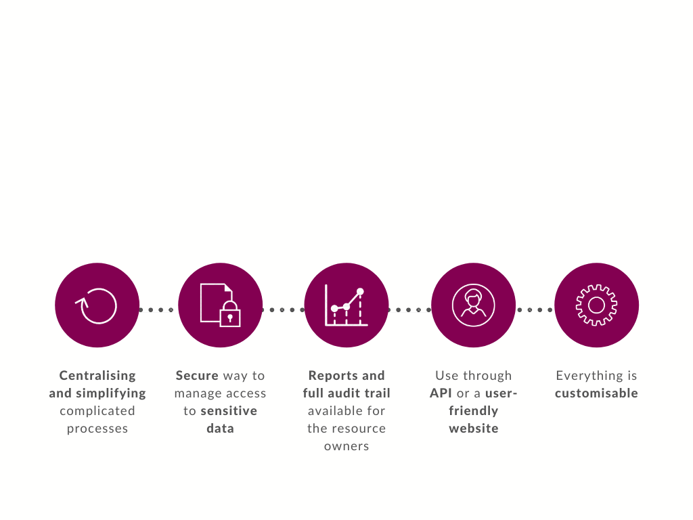
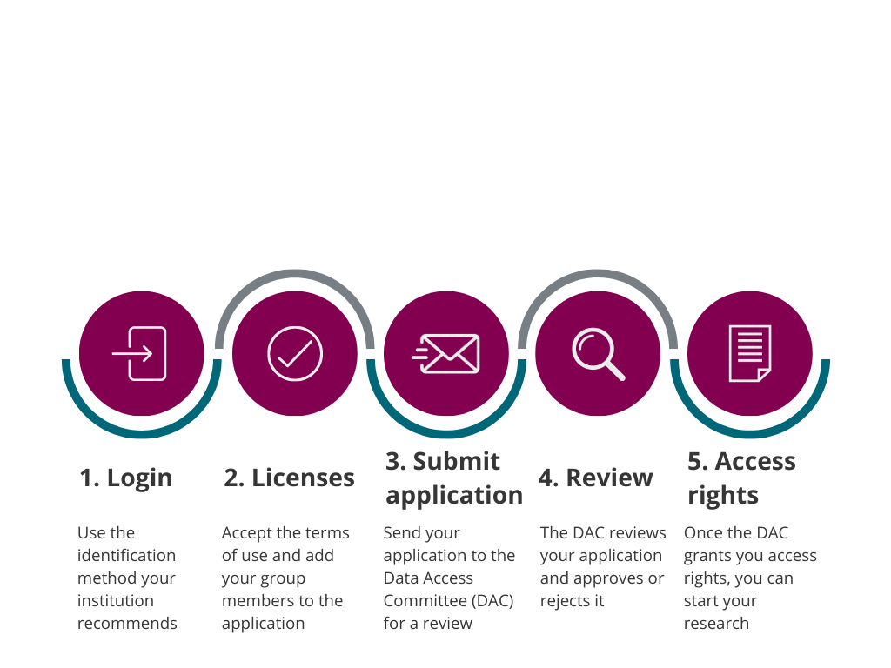

# REMS briefly

Resource Entitlement Management System (REMS) is an open source tool for managing access rights to different kinds of resources. REMS enables users to apply for access rights easily and offers a secure way for the data owners to manage access to their data.

The resources in REMS do not necessarily have to be in electronic data sets. It is possible to manage access to basically anything as long as it is identified by an identifier. This includes for example research datasets and biological samples.

REMS is a service developed by [CSC – IT Center for Science Ltd.](https://www.csc.fi/en/home) and [Nitor](https://www.nitor.com/en).

You can test how REMS works [using our demo environment](https://rems-demo.rahtiapp.fi).

## Organisations who are already using REMS

[THL, Finnish institute for health and welfare](https://thl.fi/en/web/thl-biobank/for-researchers/application-process/thl-biobank-application-portal), uses REMS to manage access to biological samples and sample related data.

According to THL, the benefits of REMS include:

- Adaptive, versatile tools for controlling resources
- Administrators have full control of the application in all stages of the process
- Different language versions
- Possibility to add attachments during the application process
- All the research group members can see the application

In addition to THL, [the Language Bank of Finland](https://www.kielipankki.fi/language-bank/) and [Findata](https://www.findata.fi/en/services/data-requests/) are also using REMS.

REMS is developed in close cooperation with our customers. You can follow the agile development of REMS from our [public Github project board](https://github.com/CSCfi/rems/projects/1).

## Why REMS

It is not always possible to share data openly. Sometimes data can contain sensitive personal data that restricts its use. However, sensitive data is also very important for research, which is why accessing it needs to be easy but secure. With REMS, **managing access to sensitive data is simple but secure**.

## Who can use REMS

REMS is useful for individual researchers who want to get access to certain resources, as well service providers who want to manage access to their material.

Benefits for the resource owner:

- **A dynamic way to handle applications and manage access rights**: The data owner can define for example, how involved they want to be in the approval process and how the process proceeds.
- **An audit trail of all committed actions and enhanced reporting tools to improve application traceability**: you can look at the application’s full processing history
- **Customisable application process**: ability to create and modify the application forms
- **Automation**: Some functions, such as approving and rejecting applications, can be automated to reduce unnecessary workload.

If you want to start using REMS to manage access rights to your resources, contact us at rems-support@csc.fi.

REMS also makes applying for access rights easier. Applicants can:

- Follow the application process easily with our event log
- See all their applications in one place and check their state easily
- Add possible research group members to their application: All the research group members will get access to the data with just one application instead of everyone applying for access separately

## Application process in brief

## Additional information

If you want to know how to apply for access rights using REMS, take a look at our [guide for the applicant](applicant.md).

If you want to use REMS to manage access to your material, read our [owner guide](owner.md).

If you need help with processing applications in REMS, you can find our [guide for handlers](handler.md).
