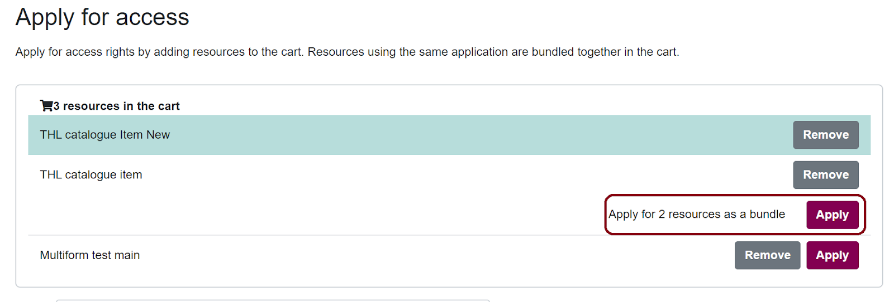
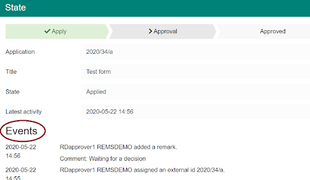
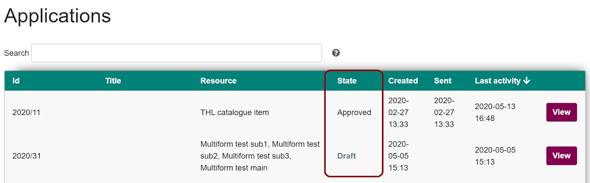

# Applying for access rights

Applicants can apply for access to different kinds of resources using REMS (Resource Entitlement Management System).

You do not need to create a user account to log in to the service because REMS uses external identity providers, such as Haka identity and Suomi.fi e-Identification. Use the identity provider your organisation/institution recommends.

:exclamation: Note! Remember to always use the same login because your applications are connected to the login identity you use.

## How to apply for access rights

You can find all the resources you can apply for access from the Catalogue tab when you are logged in. The Catalogue tab also shows your unfinished applications. Continue filling in an application by selecting **View**.

1. Start the application process by adding one or more resources to your shopping cart.
If many items can be applied for together with one application, they will be automatically bundled together for you. Otherwise you can always do multiple applications.

2. Select **Apply** to continue to the application form.
3. Follow the instructions on the application form and fill in the required fields. If you have questions regarding a specific application form, please contact the resource owner.
4. If you are a part of a research group and other group members also need access rights, remember to invite them to your application by selecting **Invite member**.
5. Accept the terms of use. Licenses define the terms and conditions for the use of the resource.
6. To submit your application, select **Send application** after you have filled in all the necessary fields.

:exclamation: Note! Once you send the application, you cannot edit it anymore.
However, removing members from the application is always possible.

Deleting sent applications is not possible because we want to always provide a full history of the application process.

:point_up: Pro tip: If you want to use one of the old applications as a template for a new application, select **Copy as new**. Note that if your old application has attachments, they will also be copied.

### Inviting members

You can invite other people to join your application by selecting **Invite member** in the application form and providing their names and email addresses. This way all the research group members can apply for access rights to resources with just one form.

Members get an email notification of the invitation immediately after you add them to your application. They can follow the link in the email to log in to REMS and accept the license terms. Members are granted access rights if the application is approved and they have accepted the license terms.

## Approval process

After you have sent the application, it will be forwarded to the application handlers who are in charge of granting the access rights. Approval process, as well as the processing time, both depend on the resource’s owner and application’s handlers.

During the approval process, a handler can:

- Approve or reject your application
- Ask for additional information and return your application to you
- Close your application and cancel the application process
- Comment your application

You can follow the approval process and read the possible comments from the application’s Events-section.

### Application states

You can find all your applications and see their state from Applications tab. The states are explained below. You will receive an email notification whenever the state of your application changes.

**Draft**: Your application is still a draft and can't be seen by the handlers. You can continue working on your application, or you can delete it completely from the system.

**Submitted**: The application has been sent to handlers and can not be edited anymore, unless specifically requested by the handler.

**Approved**: After your application has been approved and you have been granted access rights, it is up to the resource owner to deliver the resource to you. The method of delivery depends on the resource and the resource owner.

**Rejected**: To see why your application was rejected navigate to the application and select **View**. Handler’s comments will be shown in the Events-section.

**Returned**: If the handler needs additional information regarding your application, they can return your application to you.  
To edit the application, follow the link in the email or log in to REMS, navigate to the application and select **View**. You can see the handler’s comments in the Events-section. Make the changes the handler has requested and select **Send application**.

**Revoked**: Your application, and thus your access rights, have been revoked by the handler.

## When you have been granted access rights

The application handler can still manage your access rights after your application has been approved.

A handler can **close your application and cancel your access rights**. Normally, this is done after your research period ends and you do not need to access the resource anymore.

If you misuse your access rights, application handler can **revoke your access rights and add you to a blacklist**. All the members that have been added to your application will also be added to the blacklist. This means that if you,  or any of the application members try to apply for access rights again, your application will possibly be rejected.

If you feel that you have been falsely added to the blacklist, please contact the resource owner.

## User account and email notifications

You can see and edit your email address in Settings tab in the top right corner of the page.

You will be notified when:

- Your application has been approved or rejected
- Application handler needs additional information and has returned your application to you
- Application handler has changed the license terms
- Your application has been closed and your access rights have been cancelled
- Your access rights have been revoked due to misuse

The members you have added to your application also get notifications when:

- The application was approved or rejected
- Licenses have been added to the application
- Access rights have been closed or revoked

Please note that resource owners are responsible for everything related to the resources, approval process, and content of the applications. In case you have questions about any of those, please contact the resource owners.

If you want to delete your account or you are having technical problems, please contact us via email at rems-support@csc.fi. Give your email a descriptive name and mention REMS. This makes processing emails quicker.
