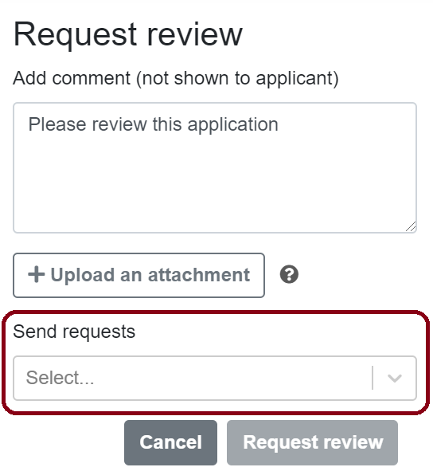
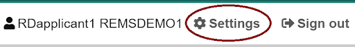

# Processing the applications

Handler, or sometimes approver, is a role assigned to REMS users who are **responsible for processing the applications and managing access rights to different resources**. This means, for example, approving or rejecting the applications and, if needed, requesting decisions and reviews from other users. Handlers can also cancel an applicant’s access rights or revoke them in case of misuse.

Resource owner is responsible for assigning the handlers. You have to **log in to REMS once before the resource owner can assign you as a handler**.

You do not need to create a user account to log in to the service because REMS uses external identity providers, such as Haka identity and Suomi.fi e-Identification. Use the identity provider your organisation/institution recommends.

:exclamation: Note! Always use the same identity provider when you log in to REMS because all your actions are connected to your login identity.

## How to process an application

You will receive email notifications about new and resubmitted applications.

To start processing applications, follow the link in the email or log in to REMS and navigate to Actions tab to see all the applications that are waiting for approval. Select **View** to open the application you want to process.

You do not have to follow any specific order when you process the applications. The approval process is fully dynamic.

:exclamation: Note! These are general instructions about the approval process. The actual practices may vary depending on the approving organisation.

### Approving or rejecting an application

You can approve or reject the application right away if the applicant has provided all the needed information. The applicant will receive an email notification about the decision.

If the applicant has added members to their application, the members will get access rights too when the application is approved, if they have accepted the terms of use. Any member not having accepted the terms of use by that time will get access rights after they log in to REMS and accept the terms of use.

:exclamation: Note! Once you approve or reject the application, the decision is final. You cannot edit it later.

If you reject an application, we recommend telling the applicant why the application was rejected by writing a comment.

A resource owner can modify the approval process so that you have to **request another user to make the decision to approve or reject** the application.

If the resource owner has removed the resource applicant is applying for access from use, REMS will give a warning, but you can still process the application. If the resource has been removed, you will not be able to approve or reject the application.

### Requesting for a decision or a review

Depending on your organisation’s practices, it might be necessary to request a decision on an application or request someone to review an application.

To request for a decision or a review, locate the user in the drop-down list or use the search function. You can add one or more users.

 

The requested user will receive an email notification about a review or a decision request.

You can still approve or reject the application even if the requested user has not reviewed the application.

You will receive an email after a decision or a review has been made. See “Email notifications” if you want to know when you will receive notifications.

### Returning the application to the applicant

If the application is **missing some information**, you can **return it to the applicant**. Write a comment on the application or attach a file of the changes you want the applicant to make.

The applicant will receive an email notification about a returned application. They can resubmit the application after editing it.

Resubmitted applications will show up in Actions tab. The changes the applicant has made will show as highlighted on the application form.

### Closing, editing and commenting on applications

You can close an application at any stage of the process by selecting **Close application**.  Closing means that the application process is cancelled and that the application cannot be modified or opened again. Write a comment why you closed the application on the comment field.

If an application is somehow inappropriate, we recommend closing it.

Deleting applications is not possible because we want to always provide a full history of the application process.

You can find closed applications Actions > Processed applications.

You can also edit the applications:

- **Change the licenses**: The applicant will receive an email notification about the change in terms of use and has to accept the new licenses before they will be granted access rights.
- **Add or remove members**: If you do not want to grant access to all the members in the application, you can remove additional members. Adding members is also possible.
- **Change the applicant**: You can change the applicant to another member of the application. This can be useful if, for example, the original applicant has left the applying organization.
- **Change the application’s resources**: If the applicant is applying for access rights to multiple resources, you can remove some of them if you do not want to grant access to all of them. It is also possible to add new resources if they can be applied for using the same application form. These will show as available in the drop-down list.

You can comment on the application throughout the application process by selecting **Remark** and choosing if you want to show the comment to the applicant or not. Applicants will receive a notification about new public comments. Sometimes it is useful for the applicant to see the comments so that they know how the approval process is proceeding. Note that the applicant cannot respond to the comments.

## After the application has been processed

You are still able to manage the applicant’s access rights after you have processed the application.

You can find the processed applications from Actions > Processed applications. Processed applications show all the applications that have been approved, rejected, closed, or returned to the applicant by any handler. Select **View** to open a specific application.

### Closing an application

Closing an application cancels the applicant’s and application members’ access rights.

When the applicant and the application members do not need the access rights anymore, for example because their research period has ended, you can cancel their access rights by selecting **Close application.**

### Revoking access rights (entitlement)

If the applicant has been granted access rights but they misuse them,  you can revoke the applicant’s rights by selecting **Revoke entitlement**.

Revoking will add the applicant and all the members to a blacklist. This means that if any of them try to apply for access rights to the same resource again, REMS will warn the application handlers. You can find the blacklist from Administration > Blacklist.

A resource owner can edit the blacklist.

## Email notifications

You will receive email notifications about other REMS users’ actions.

One resource often has more than one handler. That is why, all the application handlers who have been assigned to a certain resource, receive an email notification when one of the handlers has processed an application.

You can see and edit your email address from Settings tab in the top right corner of the page.

You will be notified when another handler has:

- commented an application
- returned the application to the applicant
- approved an application
- rejected an application
- closed an application
- revoked applicant’s access rights

You will also receive notifications when an applicant has submitted or resubmitted an application.

If you want to delete your user account or if you are having technical problems with REMS, please contact rems-support@csc.fi. Give your email a descriptive name and mention REMS. This makes processing your email quicker.

## The European Genome-phenome Archive (optional feature)

The access rights of approved applications can also be uploaded to [The European Genome-phenome Archive](https://ega-archive.org/) (EGA).

The requirements for this are:
- Enable EGA in the REMS configuration.
- Each handler who processes EGA applications must link their ELIXIR user id with their EGA user id (this happens outside REMS).
- Each handler must also generate an EGA API-key from their Profile page in REMS.

All the access rights will then be automatically pushed into EGA servers.

NB: If the EGA is enabled in the configuration, the handlers will get a warning on the Actions page
if they do not have a valid EGA API-key yet.
