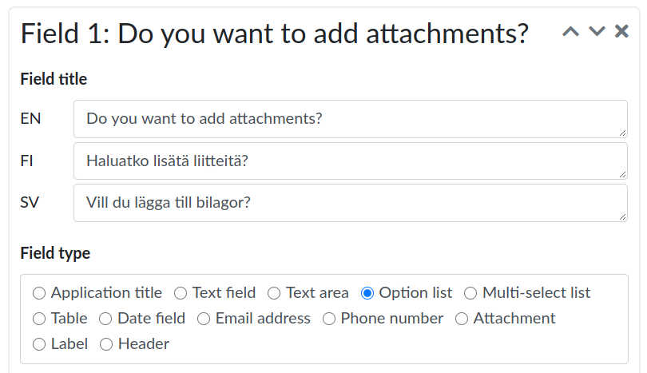
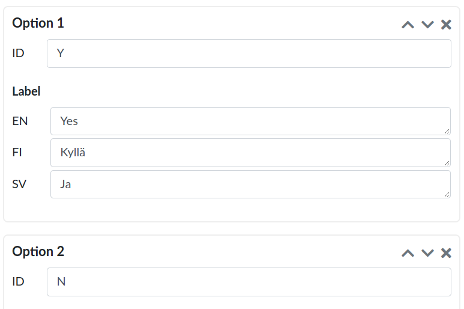
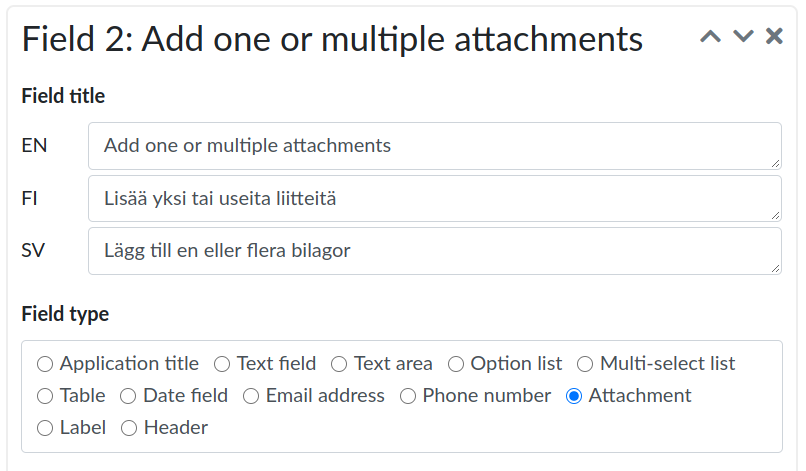
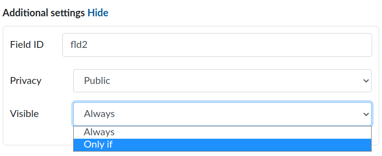

# Managing access rights to resources

REMS (Resource Entitlement Management System) offers an easy way for the resource owners to manage access rights (entitlements) to their data. Owners list their resources to REMS and keep them updated.

Resources can be anything that requires controlled access from scientific datasets to biological samples. They do not have to be in electronic form. Owners are also responsible for creating the application forms that the applicants use to apply for access rights and assigning handlers to the resources.

## How to start using REMS as a resource owner

You need an owner role before you can start using REMS to manage access to your resources.

1. To get the owner role, contact us by sending an email to rems-support@csc.fi. Give your email a descriptive name. It will speed up the process. Owner role has to be assigned by our service administrators. This will take a few days.
2. Our service administrators will ask you, and all the other users who want to have owner roles, to log in to REMS.
You do not need to create a user account to log in to REMS. You can use, for example, HAKA identity or Suomi.fi e-Identification. Remember to **always log in using the same identity provider** because your owner role and your resources are connected to it. If you want to use REMS as an applicant or a handler, log in using some other identity provider.
3. After you have logged in, our service administrators will assign owner roles to you and the other users.
4. Start adding your resources to REMS.

## How to add resources to REMS

When you add resources to REMS, you have to create:

- **Application form**: applicants use to apply for access rights
- **Workflow**: select how the applications will be handled
- **Licences**: (optional): set terms of use for your resources
- **Resource**: a technical identifier for the data set, for example a Universal Resource Name (URN)

and combine these items together by **creating a catalogue item**.

Having separate items increases flexibility and reduces manual work because when you have created the items once, you can reuse them and form new catalogue items by combining different items.

You have to **connect each item you create to an organisation**. You can use the **default organisation** for all the items. If your organisation has many departments or faculties that have their own resources, we recommend creating separate organisations for each department.

:exclamation: Note! You have to create all the other items before creating a catalogue item.

You can also use the elements that you have created earlier.

These are just general instructions and recommendations, note that your home organisation’s practices might be different.

### 1. Create an application form

1. Log in to REMS and navigate to Administration>Forms

2. Select **Create form**.
3. Name your form. Give the form a descriptive name so that you can find it easily later. The name will show in the list view.
4. Add the fields you want to have in the application. The preview on the right side shows how an applicant would see the application form.
5. Select **Save** when you are finished with the form.

:exclamation: Note! You can only edit the form as long as it has not been connected to a catalogue item.

Application forms are totally customisable. You can create different fields, such as free text or multiple choice, and add them in any order you want. Create the form in the way that best suits you and your organisation.

#### Form fields explained

**Application title**: Use this field if you want the applicants to provide a name for their application.
**Option list**: Use option list if you want the applicant to choose one of the given options. ID-code is the identifier for the option. It is shown, for example in the reports, but the applicant will only see the label fields. For example: You can put “Y” as an ID-code for Yes-option and “N” for No-option.
**Multi-select list**: Use a multi-select list if you want the applicant to choose one or more of the given options.
**Table**: You choose a set of columns for the table. The applicant can add as many rows as they wish. All columns are required for each row. You can require the applicant to fill in at least one row, if you wish.
**Email address**: Email address field will validate the email the applicant has provided.
**Attachment**: Applicant can add one or multiple attachments.
**Label**: Use labels as descriptive texts if you want to give the applicant additional information, such as instructions, regarding some field.
**Header**: Consider using headers if you want to divide the application form into sections.
**Phone number**: A phone number in an international format (E.164), e.g. +14155552671.
**IP address**: IP address field will validate the IP address the applicant has provided in IPv4 or IPv6 forms. IP address must not be within the known private range.

Placeholder texts: It is possible to add placeholder text to most of the fields. Use placeholder texts to provide an example on how the field should be filled. Placeholders help the applicant to fill in the field correctly. For example:

Field id: This is the technical identifier for the field. It is not shown to the applicant, but can be used to identify the field when fetching data via the API. It is useful when implementing integrations that read data from REMS and push it to other systems.

:exclamation: Note! **Do not give important information, such as instructions, as placeholder texts** because it will be difficult for the applicant to read and it is not accessible. Use labels or info text if you want to give instructions how to fill in a field.

:point_up: Pro tip: If you have already created application forms before, you can use an old form as a template by navigating to Administration>Forms and selecting a form and **Copy as new**.

#### Creating conditional fields

You can create fields that are hidden or shown to the applicant depending on their answers.

For example, you can create an option list “Do you want to add attachments?” Yes - No. If the applicant chooses “Yes” the attachment field is shown to the applicant. If they choose “No” they will not see the attachment field.

:exclamation: Note! Conditional fields only work with Option list and Multiselect fields.

1. Create an **Option list** and fill in the options

 

2. Create another field of any field type.

3. In the field you just created, select Additional settings>Visible>Only if

4. Field: Locate the Option list you created earlier from the drop-down list
5. Has one of the values: Select when you want the list to be shown. In this example, Field 2 "Add one or multiple attachments" is shown if the applicant chooses the "Yes" option in Field 1, "Do you want to add attachments?".

You can test how the fields work in the Preview section on the right of the page.

### 2. Create a workflow

You can choose between two different workflows: A dynamic workflow and a decider workflow. Choose the one which suits your organisation best. Remember to give your workflow a descriptive name so it will be easier for you to find it later.

**A dynamic workflow** is the default. In dynamic workflow the order of events is flexible and handlers are in charge of approving or rejecting applications. In addition, there can be reviewers and deciders.

**A decider workflow** is a restricted version of the dynamic workflow. Handlers do not have the authority to approve or reject applications. They have to request a separate decider to approve or reject the application. A decider workflow is useful for example in governmental office use.

Assign handlers for a workflow by searching the user by their username or locating them from the drop-down list. We recommend **assigning more than one handler to a workflow** to make sure there are enough handlers to process all the applications.

:exclamation: Note! You can **only find handlers that have previously logged in to REMS or have been added using the API**. If you cannot find the handler you were looking for, please ask them to log in to REMS and try again.

:point_up: Pro tip: It is also possible to make approving and rejecting automatic by selecting **Approver Bot** and **Rejecter Bot** as handlers. Approver Bot will automatically **approve all applications  where all the required fields have been filled**.  Rejecter Bot will reject the application if the applicant or any of the members attached to the application are on the blacklist. See [here](docs/bots.md) for more information.

Handlers do not get notified when they have been assigned as a handler but they receive emails about new applications.

:exclamation: Note! After saving a workflow, you cannot edit anything else than its name, organization and the handlers.

:exclamation: It's possible to invite a handler by email, if they do not have a REMS user yet. At the moment, this is only possible using the API.

#### Adding a form to a workflow

You can connect an application form to a workflow. This is useful, for example, if you have some **basic questions that apply to all the applications**, for example, billing information. When you use a workflow that has a form connected to it, you do not have to add the same questions manually every time you create a new application form.

1. Create a form with the questions you want to have in each catalogue item that uses the certain workflow.
2. Create a workflow and choose one or multiple forms that you want to connect to the workflow

Note that you will still have to add another application form when you create a catalogue item.

The applicant will see the application forms in two parts: one form that has the questions connected to a workflow and the other regarding the resource they are applying access to.

### 3. Create a license

You can create three types of licenses:

- **External link**: Provide a link to an external page with terms of use. Use links, for example, when you want to license your resources using standardised licenses, such as [Creative Commons](https://creativecommons.org/choose/?lang=en).
- **Inline text**: Write the terms of use in the application form. The applicant will see it as normal text in the application form.
- **Attachment**: Upload a license file. We recommed using PDF-format.

Licences are optional.

:exclamation: Note! You cannot edit the license after you have created and saved it.

### 4. Create a resource

1. Provide a resource identifier for your resource. [Read more about how you can create persistent identifiers](https://www.kansalliskirjasto.fi/en/services/expert-services-of-data-description/urn).
2. Select how you want to license your resource by choosing a license you have created from the drop-down list. Licensing is optional.

:exclamation: Note! You cannot edit the resource after you have created and saved it.

### 5. Create a catalogue item

Create a catalogue item by choosing an application form, a workflow and a resource you want to use. You can create a catalogue item without a form. This can be useful when using workflow forms, for example.

Give your catalogue item a descriptive name. Thus, it will be easier for the applicants to recognise which catalogue item they want access to. The name is required to be in Finnish, in English and in Swedish.

**After you have created a catalogue item, you have to enable it**. The catalogue item is disabled at first so that you can edit it before anyone will be able to apply access to it. After enabling, the applicant will see it as a resource in Catalogue tab and can apply for access to it.

:point_up: Pro tip: If you want to see how an applicant sees the catalogue items, you can navigate to the Catalog tab.

#### Editing catalogue items

You can edit the catalogue item’s name, organization and links to additional information by selecting edit.

:exclamation: Note! After saving, you cannot edit form, workflow or resource connected to the catalogue item. Editing is also not possible when some part of the catalogue item is disabled.

If you want to only change the catalogue item’s application form, select the catalogue item you want to edit and then **Change form**.

This will **disable and archive the old catalogue item** and create a new catalogue item that has a different form but is otherwise the same as the old catalogue item. This means that the applicants cannot see or apply for access to the old catalogue item anymore.

## Disabling, and archiving items

You can disable and archive all the items. Deleting is not possible because we want to offer a full history of events for information security reasons.

### Disabling items

When you disable an item, for example a form, it **cannot be used in any new catalogue items anymore**. Disabled items will be hidden from the drop-down lists.

#### Disabling catalogue items

If you disable a catalogue item, the applicant will not be able to apply for access to it anymore. However, if they have applied for access to the catalogue item before disabling, the handler can still complete the application process and approve or reject the application.

You can enable disabled items.

### Archiving

Archiving **hides the item from the administration view and from the applicants**. If you want to view archived items select **Display archived**. We recommend archiving old items that are not in use anymore.

You can unarchive archived items.

#### Archiving catalogue items

When you want to **remove a catalogue item from use**, for example because it has become outdated, we recommend **first disabling the item and then archiving** it. This way the rest of the applications can be processed before the item is archived.

Handlers are warned if the catalogue item the applicant has applied for access, has been archived. Handlers will not be able to approve or reject applications to archived catalogue items.

## Creating organisations

Organisations are useful if your organisation has for example multiple departments that have their own resources.

1. Give your organisation an ID. ID is needed when you use REMS API. A good ID is short but recognisable, for example for the organisation CSC – IT Center for Science, it would be “csc”.
2. Give your organisation a short name. This is shown in the list view. This should be a recognisable abbreviation of your organisation’s name. For example, for the organisation CSC – IT Center for Science, it would be “CSC”.
3. Give your organisation’s full name in the **Title** field. For example, for the organisation CSC – IT Center for Science, it would be “CSC – IT Center for Science”.
4. Assign organisation owners to manage organisations’ resources. Organisation owners can only create and edit resources in the organisations they are owners of.

## Blacklisting

Blacklist is a list of blocked users. You can find the blacklist Administration>Blacklist.

If a user **misuses their access rights**, you can add them to a blacklist. This means that if they try to apply for access rights to the same resource again in the future, the system will warn the application handler.

Blacklisting is always **connected to a certain resource**. This means that a user can still apply for access to other resources even if they have been blocked from applying to a certain resource.

Note! If you want that new applications from blacklisted users will be automatically rejected, you have to assign Rejecter Bot as a handler for the used workflow

### Adding users to blacklist

There are two ways to add a user to the blacklist. Handlers can add users to the blacklist by revoking access rights when they process the applications.

As an owner, you can add users to the blacklist by navigating to Administration>Resources.

1. Locate the resource the applicant has misused and select **View**.
2. Search for the user by their username or locate them from the drop-down list.
3. Add a comment why you added them to the blacklist.

If a blacklisted user tries to apply for access rights to the same resource again, REMS will warn the handler and tell that the user is blacklisted.

## Reports

REMS provides two kinds of analytics for the resources owners:
**Downloadable reports** and **an audit trail** that is available through the API.

You can download CSV reports of the applications from Administration>Reports.
Export will produce a .csv file of all the applications that have been submitted using the application form you selected. You can use for example MS excel or LibreOffice Calc to process CSV files.

REMS provides a full audit trail to the resource owner. The audit trail is a chronological record of all committed actions on any of the registered applications. You can view the audit trail using REMS API. The resource owners may also request a report that describes specific access rights, throughput times or publications using the resource from REMS support.

In case of technical problems, please contact rems-support@csc.fi.
